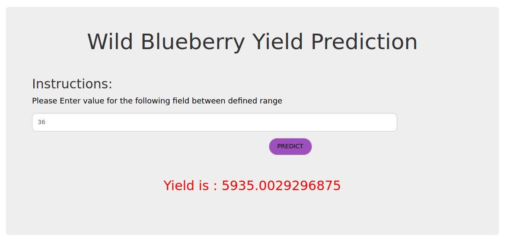

# WILD BLUEBERRY YIELD PREDICTIONUSING REINFORCEMENT LEARNING

## Problem defination
Given a dataset consisting of a variety of honeybee characteristics and weather conditions as well as data onwild blueberries; create aReinforcement Learningmodel that would be able to predict the yield ofwild blueberries when new data (that was not present in the original dataset) is provided.

For more information on this project refer [report](/Report.pdf) .

## Techstack used

- Python
- Keras
- flask
- PostqreSQL
- Heroku 
- Tableau

App is deployed using Heroku [here](https://bluberry-yield-prediction.herokuapp.com/) .

## Setup and Install 

1. Create virtual environment
1.  pip install -r requirements.txt
1. flask run

## Results

